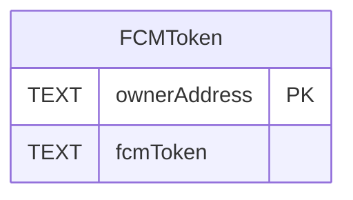
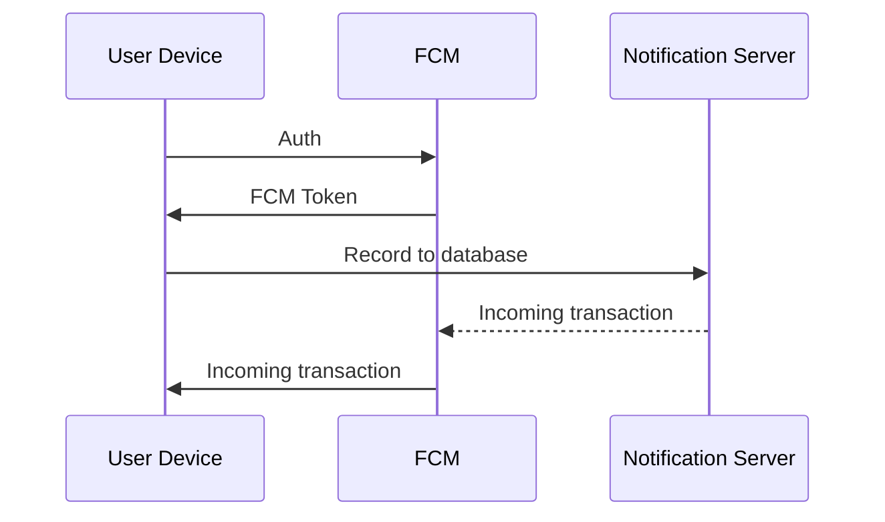
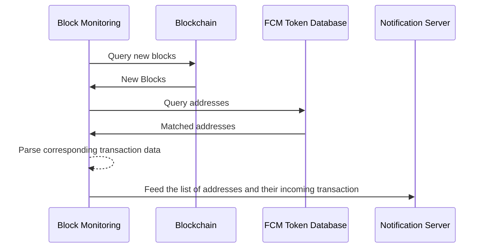
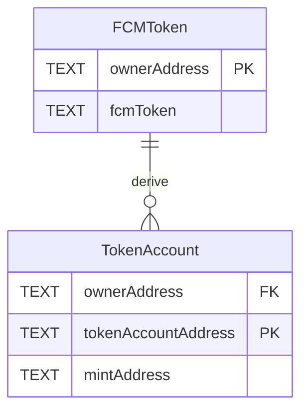

# Problem 2

How would you implement real time notifications about incoming transactions in a mobile wallet that needs to support EVM, TON, Solana and Tron? Describe what you would do for each one.

## How to run?

To able for unit tests, we won't listen new block in realtime. Instead, we get latest block and handle the new block data. For production, we should implement a realtime block listening.

```bash
pnpm install
pnpm test
```

To inspect the API, you can read the `test` folder for details.

## Justification

> Since I understand that the problems are to test my problem-solving skills, I deliberately avoided out-of-the-box solutions such as Webhooks (Alchemy), Notifications (Tatum), or Streams (QuickNode).

In a wallet scope, incoming transactions usually reflect the ETH balance changes, tokens changes, and NFT ownership changes.

Effectively, we monitor every new block and catch which addresses have balance changes (i.e. ETH & Tokens). After that, we query those addresses in our database to get their Firebase Cloud Messaging (FCM) tokens and send them notifications with the corresponding transaction data.



### Firebase Cloud Messaging

> We might explain the overall system here without implementing it in source.

FCM works like a bridge between your server and users' devices to deliver push notifications even when the application is closed, which makes it a perfect fit to the mobile crypto wallet.



### Block monitoring

To feed data to the Notification Server, the Block Monitoring must observe all accounts with state changes and filter them by the FCM token in database, where stores pairs of address and FCM token.



#### EVM & Tron

By focusing on event logs, it effective to fetch relevant transactions including internal transactions.

1. Get new blocks with full transactions.
2. Remove Contract-Creation transactions
3. Parse Call-Contract transactions

   - Get transaction's `logs`
   - Try to fit in `Erc20TransferEvent` and `Erc1155TransferSingleEvent`. If it matches, pair the transaction `hash` with `from` address and `to` address.

4. Parse Transfer-Value transactions
   - If `value` is greater than 0, pair the transaction `hash` with `from` address and `to` address.

There is optional RPC named `debug_traceTransaction` by which we can build a much faster solution. However, this one requires us build our own Fullnode, which seems very expensive for the test.

#### Solana

Different from EVM, Solana has one standardized "token contract" name SPL Token Program. By listening on this program can capturing all transactions, we can effectively parse all desired events.

1. Get new parsed blocks for full parsed transactions
2. Parse System-Program transactions by `program = 'system' & type = 'transfer'`
3. Parse SPL-Program transactions by `program = 'spl-token' & type = 'transfer'|'transferChecked'`

The result of `watch` is return of `TokenAccount` address instead of `owner` wallet. The function doesn't use `getAccountInfo` or `getParsedAccountInfo` intendedly to prevent many on-chain query. We should develop a `TokenAccount` table in the database as a persisted cache to optimize the query.

1. Query the owner address to a token account address and return if exists
2. Call `getParsedAccountInfo` to get the owner address and insert into the `TokenAccount` table, then return



#### TON

We can detect relevant messages by:

1. Get all shards info and the masterchain `seqno`.
2. Get all transactions in the shards with the latest `seqno`.
3. Parse messages (i.e. `inMessage` and `outMessages`) in the transactions:

- If `body` start `0f8a7ea5`, it is `jetton_transfer`.
- If `value.coins`, it is `ton_transfer`.

Similarly to Solana, a Ton wallet can manage multiple Jetton wallets. To offload the onchain query, we will maintain an `JettonWallet` table similar to [the `TokenAccount` table in Solana](#solana)

## References

1. [https://github.com/OpenZeppelin/openzeppelin-contracts/tree/master/contracts/token](https://github.com/OpenZeppelin/openzeppelin-contracts/tree/master/contracts/token)
2. [https://solana-foundation.github.io/solana-web3.js/](https://solana-foundation.github.io/solana-web3.js/)
3. [https://docs.ton.org/v3/guidelines/quick-start/getting-started](https://docs.ton.org/v3/guidelines/quick-start/getting-started)
