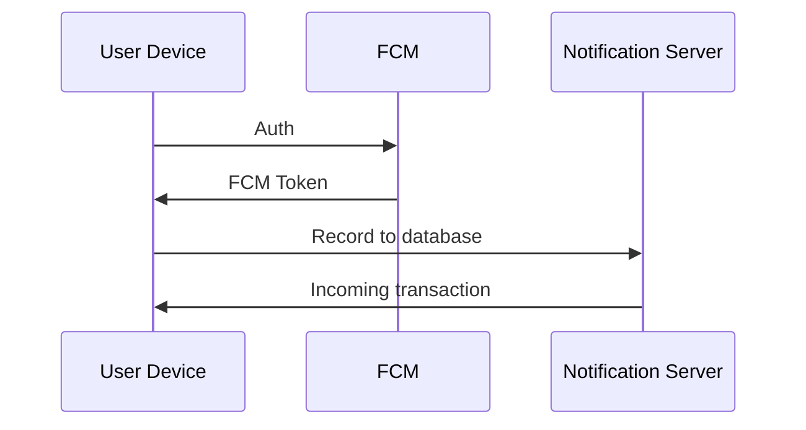

# Problem 2

How would you implement real time notifications about incoming transactions in a mobile wallet that needs to support EVM, TON, Solana and Tron? Describe what you would do for each one.

## How to run?

```bash
npm test
```

## Justification

Effectively, we monitor every new block and catch which addresses have state changes. After that, we query those addresses in our database to get their Firebase Cloud Messaging (FCM) tokens and send them notifications with the corresponding transaction data.

### Firebase Cloud Messaging

> We might recall the overall system here without implementing it in source.

FCM works like a bridge between your server and users' devices to deliver push notifications even when the application is closed, which makes it a perfect fit to the mobile crypto wallet.



## References
